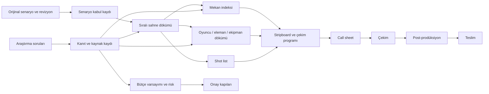

# Kısa Film Üretim Sistemi Mimarisi

## Amaç

Bu sistem, senaryo ve araştırma verisini tek bir üretim omurgasında birleştirir. İnsanların okuyacağı belgeler Markdown, tabloyla işletilecek çalışma dosyaları CSV, ilişkilerin ve doğrulama kurallarının makine-okunabilir sözleşmesi JSON olarak tutulur.

## Veri sahipliği

| Veri | Birincil kaynak | Tüketen alanlar |
|---|---|---|
| Senaryo revizyonu | `01_story/source/` ve intake kaydı | Sıralı döküm, shot list, süre |
| Sahne kimliği | `sequential_breakdown.csv` | Mekan, eleman, program, bütçe |
| Mekan kimliği | `location_index.csv` | Program, izin, ulaşım, bütçe |
| Eleman kimliği | `elements_breakdown.csv` | Art, kostüm, ekipman, bütçe |
| Araştırma kimliği | `research_log.csv` | Sahne, mekan, güvenlik, karar |
| Kanıt kimliği | `evidence_register.csv` | Araştırma güveni ve hak durumu |
| Çekim günü kimliği | `shooting_schedule.csv` | Call sheet, ekip planı, yemek/ulaşım |
| Bütçe satırı | `budget.csv` | Toplam, onay ve üretim kararı |

## Kimlik sistemi

- Proje: `PRJ-001`
- Sahne: `SC-001`
- Mekan: `LOC-001`
- Eleman: `EL-001`
- Shot: `SH-001`
- Araştırma: `RES-001`
- Kanıt: `EVD-001`
- Çekim günü: `DAY-001`
- Bütçe: `BUD-001`
- Risk: `RSK-001`
- Karar: `DEC-001`

Kimlikler bir kez verildikten sonra revizyonda korunur. Yeni veya bölünmüş sahne için yeni kimlik açılır; eski kimlik silinmez, durum alanı ve revizyon notuyla kapatılır.

## Durum akışı

`DRAFT -> REVIEW -> APPROVED -> LOCKED -> IN_PROGRESS -> DONE`

`BLOCKED` ve `NEEDS_APPROVAL`, ana akıştan ayrı güvenlik durumlarıdır. İzin, telif, ödeme, sigorta, tehlikeli çekim, müşteri/katılımcı verisi veya geri döndürülemez değişiklik varsa doğrudan `NEEDS_APPROVAL` kullanılır.

## Üretim kapıları

1. **Story lock:** Senaryonun hangi revizyonunun çekileceği kilitlenir.
2. **Breakdown lock:** Her sahne ve sahne elemanı kimliklendirilir.
3. **Location lock:** Mekan erişimi, izin, elektrik, ses ve hava riski doğrulanır.
4. **Schedule lock:** Oyuncu/ekip uygunluğu ve çekim günleri teyit edilir.
5. **Budget approval:** Tahmin, belirsizlik ve onay gerektiren harcama ayrıştırılır.
6. **Call sheet release:** Günlük plan, iletişim ve güvenlik bilgileri yayınlanır.
7. **Delivery QC:** Kurgu, ses, renk, altyazı, haklar ve dosya teknik şartları kontrol edilir.

## Araştırma ile üretim arasındaki köprü

Her araştırma kaydı en az bir üretim etkisine bağlanır:

- `story`: hikaye/karakter/diyalog
- `location`: mekan/çevre/ulaşım/izin
- `production_design`: dekor/prop/kostüm/renk
- `camera_sound`: kadraj/ışık/ses/teknik gereksinim
- `safety_legal`: risk/izin/release/telif
- `budget`: maliyet veya tasarruf varsayımı
- `audience_delivery`: festival/platform/teslim kararı

Bir bulgu hiçbir sahne, risk, bütçe veya karar alanına bağlanmıyorsa üretim paketine alınmadan önce “arka plan notu” olarak tutulur.
